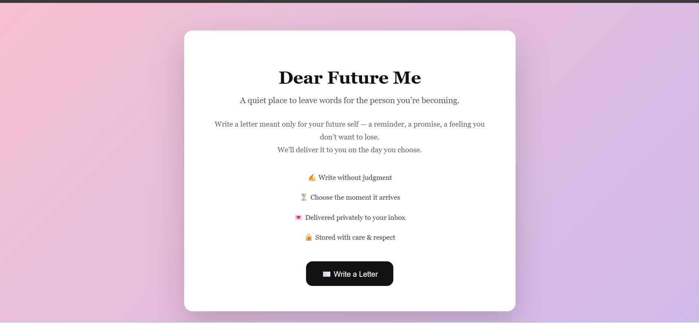
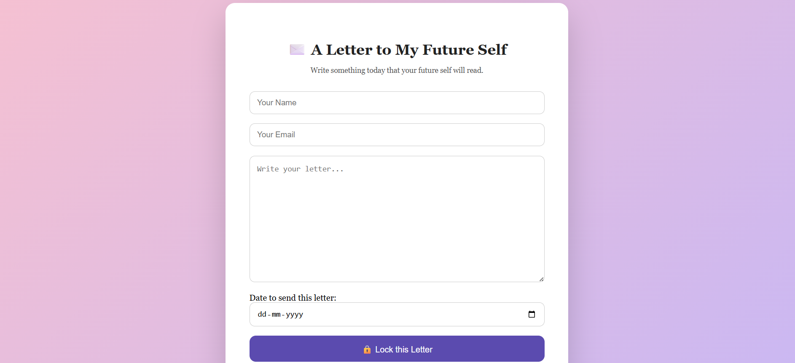
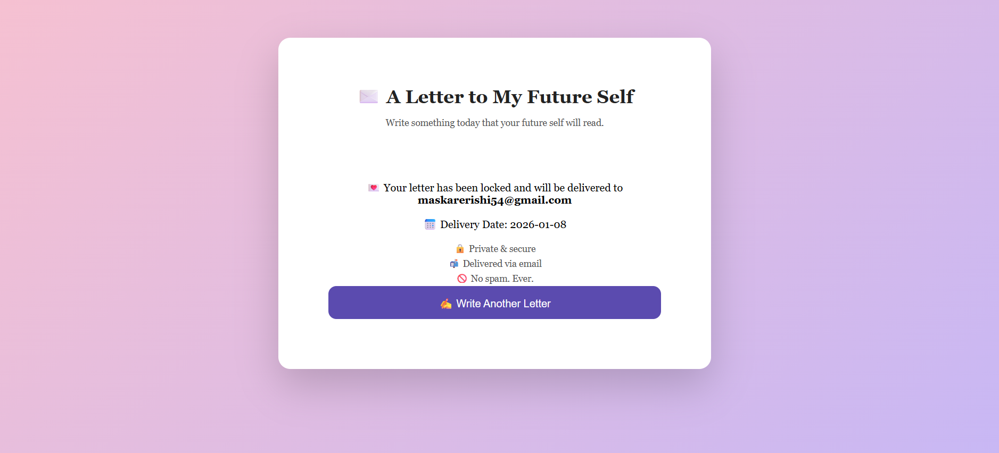

# ✉️ Letter to My Future Self

A full-stack MERN application that allows users to write letters to their future selves and receive them via email on a chosen date.  
Built with a focus on emotional connection, reliability, and real-world production practices.

---

## 🚀 Badges


[](https://letter-to-my-future-self-3nhawp3a3-rishi-maskares-projects.vercel.app/)

---

## 🌐 Live Demo

👉 **Deployed Website:**  
https://letter-to-my-future-self-3nhawp3a3-rishi-maskares-projects.vercel.app/

---

## ✨ Features

- 📝 Write a letter to your future self
- 📅 Select a future delivery date
- ⏰ Scheduled email delivery using cron jobs
- 📧 Reliable email sending via SendGrid
- 🌍 Timezone-safe scheduling (IST handled correctly)
- 💾 Secure storage using MongoDB
- 🎨 Clean and minimal UI

---

## 🛠️ Tech Stack

**Frontend**
- React.js
- CSS

**Backend**
- Node.js
- Express.js
- MongoDB
- Node-Cron
- SendGrid

**Deployment**
- Frontend: Vercel
- Backend: Render 

---

## 📸 Screenshots

### 🏠 Home Page


### ✍️ Write a Letter


### ✅ Success Message


---

## ⚙️ How It Works

1. User writes a letter and selects a future date
2. Letter is securely stored in MongoDB
3. A cron scheduler checks pending letters
4. When the date matches, the email is sent automatically
5. Letter is marked as delivered to avoid duplicates

---

## ⚠️ Known Limitations

- 📧 **Emails may land in the spam/junk folder**  
  Currently, the application uses SendGrid without a verified domain or business authentication. This means some email providers might classify the letters as spam.  

- 🛠️ **Recommendation for real-world use:**  
  To ensure emails reliably reach the inbox, set up domain authentication with SendGrid and verify your account as a business.

### 💡 Tips for Users
- Check your **Spam/Junk folder** if you don’t see your letter in the inbox.
- Adding the sending email to your **contacts or whitelist** may help.
- For testing purposes, you can also use your own email services like Gmail or Outlook with proper configuration.

---

## ⚡ Getting Started (Run Locally)

### 1. Clone the Repository

```
git clone https://github.com/RishiMaskare/letter-to-my-future-self.git
cd letter-to-my-future-self
```

2. Backend Setup

```
cd backend
npm install
```
Create a .env file in the backend folder with the following content:

```
PORT=5000
MONGODB_URI=<your MongoDB connection string>
SENDGRID_API_KEY=<your SendGrid or SMTP key>
ENCRYPTION_KEY=<your secret key>
FRONTEND_URL=<your deployed frontend URL>
```
Start the backend server:
```
npm run dev
```
3. Frontend Setup
```
cd frontend
npm install
```
Create a .env file in the frontend folder with the following content:

```
VITE_BACKEND_URL=http://localhost:5000
```
Start the frontend server:
```
npm run dev
```
Your app should now be running locally at http://localhost:5173 (or the port shown in your terminal).

👤 Author
Rishi Maskare

📧 Email: maskarerishi54@gmail.com

🐙 GitHub: https://github.com/RishiMaskare


